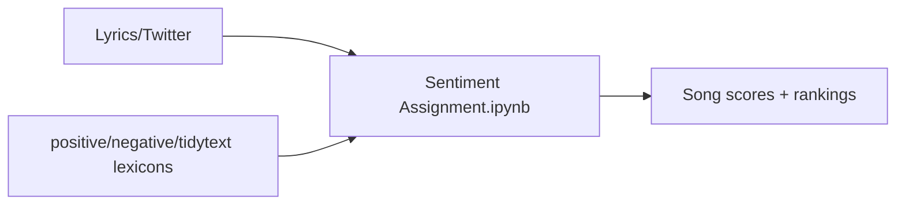
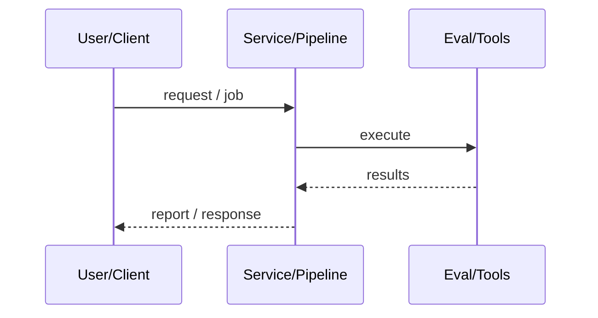
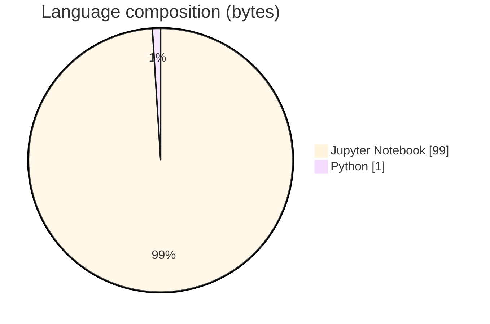

# Lexicon Sentiment Analysis on Lyrics & Twitter

### ADS 509 Module 6 assignment scoring song and tweet sentiment with polarity lexicons.

[](https://github.com/ArchanaChetan07/Sentiment-Analysis-on-Text)
[](https://github.com/ArchanaChetan07/Sentiment-Analysis-on-Text)
[](https://github.com/ArchanaChetan07/Sentiment-Analysis-on-Text)
[](https://github.com/ArchanaChetan07/Sentiment-Analysis-on-Text/actions)

---

## Overview

Score sentiment of artist lyrics and Twitter corpora using positive/negative and tidytext lexicons.

Sentiment Assignment.ipynb loads lyrics/twitter folders plus positive-words.txt, negative-words.txt, tidytext_sentiments.txt; sums word polarity scores per song; compares top/bottom songs.

Completed course assignment notebook pattern with bundled lexicons (external corpora paths often local).

This repository is maintained as **production-minded portfolio work**: clear architecture, automated checks where present, and metrics that are **traceable to committed artifacts** (never invented).

---

## Architecture

Lyrics + Twitter files + lexicons → tokenize words → sum polarity → rank songs / analyze tweets → plots.





---

## Results & repository facts

> Only values found in code, configs, tests, or generated reports are listed. Absence of a clinical/ML accuracy number means it was **not** published in-repo.

| Metric | Value | Source |
|---|---|---|
| Tracked repository files | **8** | `git tree` |
| Notebook cells | **24** | `Sentiment Assignment.ipynb` |
| Tracked files | **8** | `git tree` |
| Python modules | **1** | `git tree` |
| Test-related paths | **1** | `git tree` |
| CI workflows | **Yes** | `.github/workflows` |
| Docker present | **No** | `repo root` |



---

## Key features

- Manual lexicon scoring (+1/-1)
- Bundled positive/negative/tidytext lexicons
- Song-level ranking examples in notebook

---

## Tech stack

| Layer | Technology |
|---|---|
| nlp | Lexicon sentiment |
| nlp | NLTK |
| data | pandas |
| viz | matplotlib/seaborn |
| ci | GitHub Actions |

---

## Skills demonstrated

Jupyter Notebook · p · a · n · d · s · CI/CD · testing · automation

Keyword surface: **Python · Jupyter Notebook · machine-learning · CI/CD · testing · API · Docker · automation · data-science · software-engineering · system-design · observability · LLM · cloud**

---

## Project structure

```text
Sentiment-Analysis-on-Text/
├── Sentiment Assignment.ipynb
├── positive-words.txt
├── negative-words.txt
├── tidytext_sentiments.txt
├── requirements.txt
└── tests/
```

---

## Installation & usage

```bash
git clone https://github.com/ArchanaChetan07/Sentiment-Analysis-on-Text.git
cd Sentiment-Analysis-on-Text
pip install -r requirements.txt
jupyter notebook "Sentiment Assignment.ipynb"
```

---

## How it works

After pointing data_location at lyrics/twitter folders, the notebook builds a sentiment dictionary from lexicons and scores each song by summing word polarities, then answers comparative questions.

---

## Future improvements

- Make data_location relative / ship sample subset
- Export summary tables as CSV artifacts

---

## License

See repository.

---

<p align="center">
  <b>Lexicon Sentiment Analysis on Lyrics & Twitter</b><br/>
  <a href="https://github.com/ArchanaChetan07/Sentiment-Analysis-on-Text">github.com/ArchanaChetan07/Sentiment-Analysis-on-Text</a>
</p>
